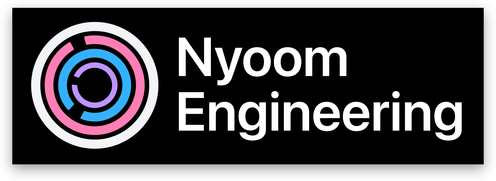
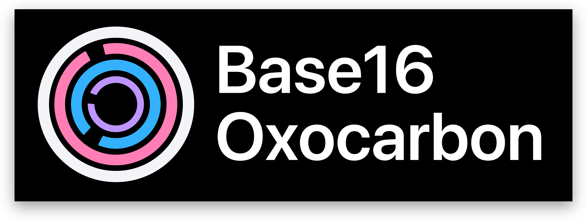
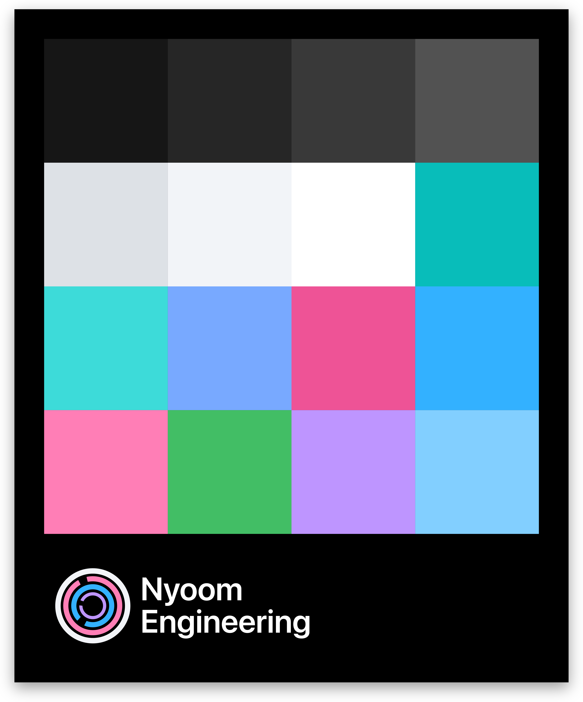

# Nyoom-Engineering

This repository contains the designs and tooling for branding of the Nyoom Engineering project

## Dependencies

`GNU Make`, `Cargo`/`Rust`, and the `SF Pro Display` font are required

## Logo

The `assets/` directory contains two vector logos for the project, one with only the icon and one with text

- `logo-icon.svg`


- `logo.svg`



## svg-renderer

The `svg-renderer` crate assists with rendering SVGs to raster files. It can be used standalone as follows:

```sh
cd svg-renderer
cargo run -- x.svg
```

By default, it will render to standard desktop display resolutions as a PNG. Alternatively, you can customize the width in PX:

```sh
WIDTHS="3840" cargo run -- x.svg
```

## svg-replace

The `svg-replace` crate assists with generating a logo SVG with custom text. 



It can be used standalone as follows:

```sh
cd svg-replace
cargo run -- "a" "b"
```

Where `a` and `b` are both words and `a < b` in length

## base16-renderer

The `base16-renderer` crate assists with rendering a base16 file in `.json` format to a tiled display complete with the Nyoom Engineering branding and style



It can be used standalone as follows:

```sh
cd base16-renderer 
cargo run -- base16.json
```

Where `base16.json` is a json file containing a base16 colorscheme as key-value pairs with hexadecimal notation. See `assets/oxocarbon-dark.json` for an example

## Makefile

For ease of development, a GNU Makefile is provided with the following: 

- `make logo` to render the text logo
- `make icon` to render the icon logo
- `make base16` to render the base16 palette display
- `make custom` to generate an example custom logo with "Base16" and "Oxocarbon" text
- `make build` compiles the rust crates in the repository
- `make clean` cleans `out/` and crates

The following commands require [imagemagick](https://imagemagick.org/index.php) to be installed and added to PATH

- `make shadows` will use imagemagick to apply a drop-shadow to all raster images in `out/`
- `make`/`make all` will do all of the above